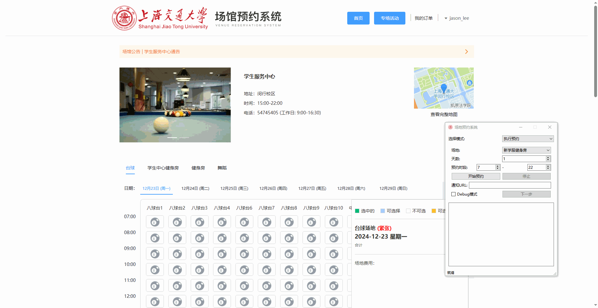

# 使用教程

## 1 标定坐标

打开程序，选择标定坐标模式。点击开始标定，弹出输入URL窗口。

进入微信“喵提醒”公众号，点击“我的提醒”。

点击新建提醒单，随意给定名字，点击保存。

返回提醒单列表，点击进入，单击“网址”复制URL链接， 粘贴到程序的输入框内。点击OK。

任意找到一个可以预约的图标（不必是想要预约的运动类型），将鼠标放置在图标上（建议可以将光标放置在黄色部分），按下键盘c键，获取RGB颜色。

点击选择可预约的图标，立即下单。将鼠标悬停在弹出窗口的勾选框处，按下c键记录<坐标1>。

鼠标悬停在提交订单按钮后按下c键记录<坐标2>。

现在请打开要预定的运动类别网页，不要滑动页面，鼠标悬停在对应运动类别上,按下c键记录<坐标3>。

鼠标悬停在<第一个日期>上后，按下c键记录<坐标4>。

鼠标悬停在<最后一个日期>上后，按下c键记录<坐标5>。

将鼠标悬停在拖动网页滑动条起始位置处，先按下c键获取滑动起点<坐标6>。

拖动网页滑动条，直到所有可预约按钮和立即下单按钮全部出现在视野内，保持鼠标放置在滑动条上，按下c键获取滑动终点<坐标7>，松开鼠标。

鼠标悬停在第一个场地后，按下c键记录<坐标8>。

鼠标悬停在<最后一个场地>后，按下c键记录<坐标9>。

鼠标悬停在<立即下单>按钮后，按下c键记录<坐标10>。

保存conf文件。

## 2 执行预约

执行预约后，程序会一直刷新页面，自动识别预约按钮颜色是否发生变化，在有场地时自动点击并给微信公众号发送通知。

可预约场地演示。

## 3 界面介绍

- 场地：在conf文件夹中保存了标定结果后，场地处就可以选择对应的配置了。
- 天数：1表示今天，2表示明天，以此类推。
- 预约时段：可以指定只识别部分时间段的场地。例如17-18就表示17点到18点的场地，但是不包含18-19点的场地。
- 停止按钮：点击停止按钮后，会执行完下一个动作周期再停止程序。需要耐心等待一下。
- 通知URL：微信公众号通知的链接，详情见“1 标定坐标”部分的教程。
- Debug模式：选中Debug模式后，再点击开始预约，可以点击下一步逐步执行程序。

## 4 软件文件构成

- AutoSportsv3.3.exe：主程序，点击运行。
- booking.ico：软件图标。
- conf文件夹：存放各种场地的配置信息，程序运行时会读取配置信息。
- img：存放使用教程markdown中的图片。
- screenshot：程序每次进行截图识别后都将图片存储在这个文件夹内，可以在debug过程中截图后打开这个文件夹检查截图区域是否正确。
- 使用方法.md：使用教程，用vscode、Typora、Obsidian等markdown编辑器打开。